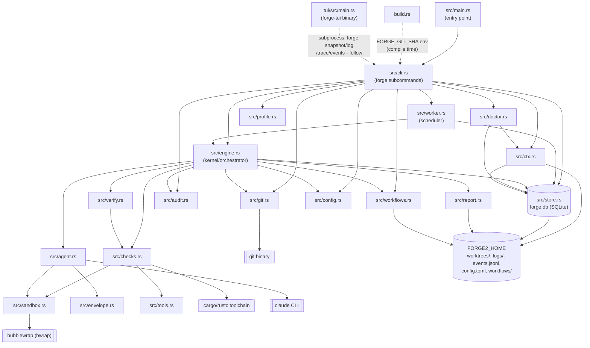

## Components

**src/main.rs** is the process entry point for the `forge` binary; it declares the crate's modules and immediately delegates to `cli::main()`.

**build.rs** runs at compile time, shelling out to `git rev-parse --short HEAD` in the build tree and exposing the result as the `FORGE_GIT_SHA` compile-time env var (empty string if git is unavailable or the build isn't in a checkout). `src/cli.rs`'s `version` command reads this via `env!("FORGE_GIT_SHA")` alongside `env!("CARGO_PKG_VERSION")` from Cargo.toml.

**src/cli.rs** implements every `forge` subcommand (`run`, `add`, `work`, `log`, `retry`, `show`, `doctor`, `trace`, `requests`, `stats`, `events`, `snapshot`, `land`, `integrate`, `journal`, `gc`, `workflows`, `version`, ...). It validates operator input, owns terminal/JSON output, and dispatches into `engine`, `worker`, `store`, `workflows`, `config`, `git`, `doctor`, and `audit`.

**src/engine.rs** is the kernel: `run_task` drives a task through its resolved workflow, running directive steps (agent attempt + verification) and operation steps (declared shell commands), handling retries, feedback, and journaling. `integrate` merges, re-verifies, and lands a task's branch. It calls `agent`, `verify`, `checks`, `git`, `config`, `store`, `workflows`, `audit`, and `report`.

**src/worker.rs** is the long-running scheduler behind `forge work`: it claims queued tasks from the store and runs them concurrently via `engine::run_task`, enforcing budget and rate-limit holds and handling graceful shutdown.

**src/store.rs** persists all task/attempt/op state in a SQLite database (`forge.db` under `FORGE2_HOME`, WAL mode, forward-only migrations). Its `tasks`, `attempts`, and `ops` tables record queue state, per-attempt inputs/outputs/verdicts, and operation history; `stats`/lineage/profile queries read from it.

**src/workflows.rs** loads, validates, and resolves workflow and action definitions from TOML files under `FORGE2_HOME/workflows/` (a self-versioned git repo, hashed by git blob id), including the built-in workflows/actions shipped with the binary.

**src/verify.rs** implements the L0 (git/contract), L1 (repo `forge.toml` checks), and L2 (task-declared checks) verification levels and the terminal-state decision table (`decide`) that `engine` uses to judge an attempt.

**src/checks.rs** runs a single check command (agent-launched or repo/task-declared) under the sandbox with a timeout, tail capture, and test-failure extraction; it shells out to toolchain binaries such as `cargo`.

**src/doctor.rs** implements `forge doctor`, a set of health checks covering required binaries, sandbox availability, the home directory, config, the database, workflows, worker liveness, disk usage, and budget/rate-limit state.

**src/git.rs** wraps all git subprocess plumbing (clone, fetch, merge, push, archive/graft, ls-tree, identity), isolating each task's worktree from the registered repo's `.git` and remote.

**src/sandbox.rs** builds the `bwrap` (bubblewrap) command line that isolates agent and check subprocess execution behind a read-only host filesystem and tmpfs `$HOME`, with only the worktree and configured toolchain/cache paths bound in (disabled only via `FORGE2_SANDBOX=0`).

**src/agent.rs** spawns the `claude` CLI (or `$FORGE2_CLAUDE_BIN`) under the sandbox with a structured JSON schema, and parses its streamed JSON output into an `Outcome` (cost, tokens, structured envelope, rate-limit samples).

**src/audit.rs** defines the `Inputs`/`Outputs` structs recorded per attempt and `diagnose()`, a deterministic table mapping failure reasons to human-readable diagnosis and next action.

**src/report.rs** defines the typed `Event` enum and the `Reporter` that serializes events to `FORGE2_HOME/events.jsonl` (rotated at 50MB) and to stderr.

**src/envelope.rs** defines the agent's structured-result JSON schema and parser (`Envelope`, `NeedsInput`, `Change`, `Claim`) used to interpret what an agent attempt reported doing.

**src/tools.rs** parses an attempt's stream-json log into tool/shell/file-read usage statistics for cost diagnostics.

**src/config.rs** parses the repo's `forge.toml` (declared checks, protected paths, hidden-test namespace, base branch/remote) and the operator's `FORGE2_HOME/config.toml` (budget, sandbox paths).

**src/ctx.rs** resolves `FORGE2_HOME` (`Paths`) and builds `Forge`, the shared process context (store handle, budget, sandbox, reporter) used across the CLI and engine.

**src/profile.rs** computes statistical profiles of workflow runs (Wilson intervals, regression detection), used by `cli`'s workflow listing and by `doctor`.

**tui/src/main.rs** is a separate binary (`forge-tui`, its own crate in the `tui` workspace member) that never opens the database or links the kernel; it is a pure client that shells out to the `forge` binary (`forge snapshot`, `forge log --json`, `forge trace --json`, `forge requests --json`) and streams live updates by spawning `forge events --since <offset> --follow`.

**forge.db** (SQLite, under `FORGE2_HOME`) is the durable store for tasks, attempts, and ops, owned exclusively by `src/store.rs`.

**FORGE2_HOME filesystem** (default `~/.local/share/forge2`) holds `forge.db`, per-task `worktrees/`, per-attempt `logs/`, the rotated `events.jsonl` event stream, the operator's `config.toml`, and the `workflows/` git repo.

**git binary**, **cargo/rustc toolchain**, **claude CLI**, and **bubblewrap (bwrap)** are external systems invoked as subprocesses by `src/git.rs`, `src/checks.rs`, `src/agent.rs`, and `src/sandbox.rs` respectively; forge has no direct GitHub API or network integration beyond constructing a human-facing compare URL string in `src/git.rs`.
