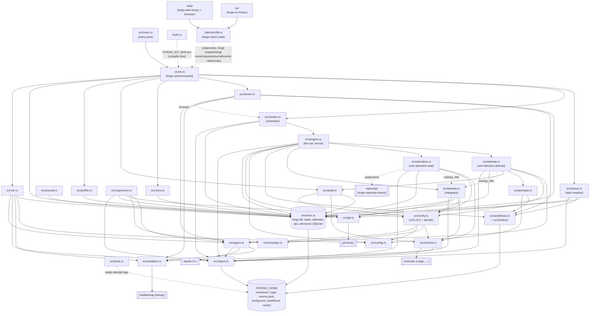

## Data flows

**Task creation, through the queue.** `forge run`, `forge add`, `forge retry`, `forge answer`, and the supervisor's own decisions all build a `TaskRequest` and hand it to `queue::enqueue` (`src/queue.rs`). `enqueue` validates the request against the registered repository and the resolved workflow (`src/workflows.rs`, backed by `src/builtins/` and `FORGE2_HOME/workflows/`), inserts the task as `store::Task` in state `Queued`, carries a retried task's dependents along, and emits a `task_queued` event. `forge work` (`src/worker.rs`) polls the store for queued tasks, claims one per job slot, and hands it to `engine::run_task`.

**The run, through attempt and verify.** `src/engine.rs` drives a claimed task through its resolved workflow: an ordered list of actions, each either a directive or an operation. A directive step runs through `src/attempt.rs`'s `run_attempt`: it builds the contract's prompt (`src/prompts.rs`, with the journal from `src/journal.rs` folded in), launches the agent (`src/agent.rs`, sandboxed by `src/sandbox.rs`, spawning the `claude` CLI), and hands the result to `src/verify.rs`, which runs L0 (git/contract consistency), L1 (the repository's declared checks, via `src/checks.rs` and `src/sandbox.rs`), and L2 (the task's own acceptance commands) in order, overlaying the hidden verification refs from `src/landing.rs::overlay_refs` for the duration. An operation step runs through `src/operation.rs`, which runs a declared command (in the task's clone, or a scratch copy of base for one that reads the hidden tests — sometimes shelling out to `repomap/` for the repo-map builtin) and turns its output into a product or a verified change. Every attempt and operation is recorded as a row on the task (`src/store.rs`); every fault is classified `Task` (fails the task) or `Env` (stops the worker) by `engine::Classify`; `src/audit.rs` turns a failure into a diagnosis and `src/tools.rs` turns an attempt's log into cost/usage facts. A task that stops with a question (or a review demotion) can be picked up by `src/supervisor.rs`, which answers, files a prerequisite, marks it superseded, accepts the demotion, or escalates to the human.

**Landing.** After a task's last directive verifies, `engine` calls `src/landing.rs::integrate`: the base is fetched (`src/git.rs`), merged in if it moved, the merged tree is re-verified with the standing hidden suite under a per-repository lock, and the branch is fast-forwarded onto the base. A conflict or a failing check sends the task back to the coder as a rewind instead of landing it. `forge land` and `forge integrate` (`src/cli.rs`) run the same function by hand.

**Events, to clients through the client crate.** Every event the engine, worker, queue, attempt, operation, landing, and supervisor have to report is a typed `Event` (`src/report.rs`), appended to `FORGE2_HOME/events.jsonl` (rotated at 50MB) and to stderr; nothing downstream of `report` reaches back into the kernel. `src/view.rs` shapes the store's rows into the text/JSON forms `forge log`, `forge trace`, `forge requests`, `forge journal`, and `forge decisions` print. `client/src/lib.rs` (the `forge-client` crate) is the one Rust reader of that surface: it runs `forge snapshot`, `forge events --since <offset> --follow`, and the `--json` verbs as subprocesses, parses their output into typed rows, and never opens `forge.db` or links the kernel. `tui/` (the `forge-tui` binary) and `web/` (the `forge-web` binary, serving `web/src/app.js` to a browser over token-gated SSE) are both clients of `forge-client` and nothing else; a kernel change that doesn't change a `forge` verb's JSON changes neither of them.

## Components

**src/main.rs** is the process entry point for the `forge` binary; it declares the crate's modules and delegates to `cli::main()`.

**build.rs** runs at compile time, shelling out to `git rev-parse --short HEAD` and exposing the result as the `FORGE_GIT_SHA` compile-time env var, read by `forge version`.

**src/cli.rs** implements every `forge` subcommand (`run`, `add`, `work`, `log`, `retry`, `answer`, `decisions`, `show`, `supervise`, `doctor`, `workflows`, `trace`, `requests`, `stats`, `events`, `land`, `integrate`, `journal`, `gc`, `version`). The engine never prints; this does. It validates operator input and dispatches into `queue`, `worker`, `view`, `audit`, `profile`, `git`, `doctor`, and `ctx`.

**src/queue.rs** is how a task comes to exist: every entry point builds a `TaskRequest`, and `enqueue` validates it against the repository and workflow directory, inserts it, carries a retried task's dependents along, and emits `task_queued`.

**src/worker.rs** is the running system behind `forge work`: claim, run, repeat, stay up. `drive` turns a fault into an outcome — a task fault fails the task, an environment fault requeues it and stops the worker. It runs up to `--jobs` tasks at once via `engine::run_task`, polls on an empty queue, and drains on shutdown signal (a second SIGINT/SIGTERM aborts running attempts).

**src/engine.rs** is the kernel: `run_task` drives a task through its resolved workflow, running directive steps (`attempt::run_attempt`) and operation steps (`operation::run_operation`), inserting a verify after every directive and a push after the last action, retrying with feedback, and journaling. It classifies every fault as `Task` (this task's problem) or `Env` (the worker cannot do its job) — the git fault rule: an operation on a task's own clone is a `Task` fault, cloning/fetching/locking the shared repository is an `Env` fault.

**src/attempt.rs** runs one attempt of a directive: builds the contract's prompt (`prompts`), records what the agent was given, launches it (`agent`), and hands the result to `verify` for a `Verdict`. The `Spec` a contract fills in says where the agent works, what it is told, which refs are overlaid, and what the verdict needs.

**src/operation.rs** runs one workflow step that is a command, not an agent: in the task's clone (or a scratch copy of base for a step that reads the hidden tests), with the task's facts as environment. What it prints becomes a product (context, interface) or a change the kernel commits and verifies; the built-in `repo-map` operation shells out to the `forge-repomap` binary.

**src/landing.rs** is the integrator: after a task's last directive verifies, the base is fetched, merged in if it moved, the merged tree is verified with the standing hidden suite, and the branch is fast-forwarded onto the base under a per-repository lock. A conflict or a failing check goes back to the coder as a rewind. `forge land` runs the same function by hand.

**src/verify.rs** implements the L0 (git/contract), L1 (repository's declared checks, overlaid from trusted refs), and L2 (task-declared checks) verification levels, and `decide`, the pure terminal-state decision table `engine` uses to judge an attempt. A level runs only if the one before it passed; the overlay is removed afterward so the next attempt starts blind.

**src/checks.rs** runs a single check command (agent-launched or repo/task-declared) under the sandbox with a timeout, tail capture, and test-failure extraction; it shells out to toolchain binaries such as `cargo`.

**src/envelope.rs** defines the agent's structured-result JSON schema and parser (`Envelope`, `NeedsInput`, `Change`, `Claim`) that `verify` and `supervisor` use to interpret what an agent attempt reported doing.

**src/journal.rs** derives, from a task's lineage, one entry per attempt with the kernel's verdict, what the checks found, and what the agent claimed; the prose form agents read is rendered from those entries, verdict first, cut to a budget from the oldest end. What a coder learns of the hidden tests through it is the interface alone, never the test author's words.

**src/prompts.rs** builds what each contract's agent is told: a frame (rules stated once), a per-contract role paragraph, and a shared tail (where things are, the journal, the attempt line, the action's own `prompt`). The exact text is the first frame of every attempt log.

**src/supervisor.rs** is the rung between a blocked task and the human: a read-only agent on a strong model reads the repository's record and answers (citing a path, task, or decision), files a prerequisite task, marks a task superseded, accepts a review demotion, or escalates. It cannot write code; an uncited or unresolving answer becomes an escalation, and every answer is a `decisions` row.

**src/workflows.rs** (with **src/builtins/**, the workflows/actions/operations shipped with the binary) loads, validates, and resolves workflow and action definitions from TOML files, identified by git blob hash. A task resolves everything once at creation and runs from that record, so an edit landing mid-run cannot change it. See `docs/ACTIONS.md` and `docs/WORKFLOWS.md`.

**src/doctor.rs** implements `forge doctor`: OK/WARN/FAIL checks over required binaries, sandbox availability, the home directory, config, the database, workflows, worker liveness, the repomap cache, disk usage, and budget/rate-limit state; exits 1 on any FAIL.

**src/audit.rs** defines the `Inputs`/`Outputs` recorded per attempt and `diagnose()`, a deterministic table mapping failure reasons to a human-readable diagnosis and next action.

**src/profile.rs** computes statistical profiles of workflow runs (Wilson intervals, regression detection) from the store; a workflow with too few runs is `unknown`. Used by `cli`'s workflow listing and by `doctor`.

**src/tools.rs** parses an attempt's stream-json log into tool/shell/file-read usage statistics for cost diagnostics — facts for `audit`, never opinions.

**src/git.rs** wraps all git subprocess plumbing (clone, fetch, merge, push, archive/graft, ls-tree, identity): every task works in its own single-branch clone, the registered checkout is only ever read, and the sandbox never sees the repository's own `.git`.

**src/sandbox.rs** builds the `bwrap` command line that isolates agent and check subprocesses behind a read-only host filesystem and a tmpfs `$HOME`, with only the task's clone, the agent binary, and configured toolchain/cache paths bound in. On by default; refuses to run without `bwrap` unless `FORGE2_SANDBOX=0`.

**src/agent.rs** spawns the `claude` CLI (or `$FORGE2_CLAUDE_BIN`) under the sandbox and reads its stream-json output under a wall-clock timeout into an `Outcome` (cost, tokens, structured envelope, rate-limit samples); the raw stream is the attempt's log.

**src/config.rs** parses two configs: the repository's `forge.toml` (declared checks, protected paths, hidden-test namespace, base branch/remote), read from the trusted base commit so the branch under test cannot change what it is verified against, and the operator's `FORGE2_HOME/config.toml` (budget, sandbox paths).

**src/ctx.rs** resolves `FORGE2_HOME` (`Paths`) and builds `Forge`, the shared process context (store handle, budget, sandbox, reporter) used across the CLI and engine.

**src/view.rs** is the one place the CLI's machine-readable rows are shaped: `forge log`, `forge trace`, `forge requests`, `forge journal`, and `forge decisions` each have a text form and a `--json` form, both rendered from the same struct so the two cannot drift apart.

**src/report.rs** defines the typed `Event` enum and the `Reporter` that serializes events to `FORGE2_HOME/events.jsonl` (rotated at 50MB) and to stderr; a JSON or web consumer is another reader, never a change to the engine.

**src/store.rs** persists all task/attempt/op/decision state in a SQLite database (`forge.db` under `FORGE2_HOME`, WAL mode, forward-only migrations numbered by `user_version`) across four tables — `tasks`, `attempts`, `ops`, `decisions`.

**client/ (forge-client crate)** is the one Rust client of the `forge` CLI: it runs a `forge` verb, parses its `--json` output, and hands back typed rows — never the database, never the kernel. `docs/CLIENT.md` is the contract it implements; every field is `#[serde(default)]` so an older `forge` binary's output still parses.

**tui/ (forge-tui binary)** is the operator's seat: it takes a `snapshot`, subscribes to `events --follow` from the offset the snapshot names, re-reads `log`/`requests`/`trace` as JSON only when an event says something changed, and acts through `forge retry` — all via `forge-client`.

**web/ (forge-web binary)** is a browser client at the same seam as the TUI: every read is a forge verb's JSON and the live feed is `events --follow` piped through as server-sent events; the one write route, `POST /api/retry/<id>`, is the same `forge retry` verb. Every request carries a token generated into `FORGE2_HOME/web.token`; the server binds loopback unless told otherwise. `web/src/app.js` renders the `/tasks`, `/tasks/<id>`, and `/tasks/<id>/run` views client-side.

**repomap/ (forge-repomap binary)** is a standalone binary, not a library dependency: `index` parses every tracked file into its symbols, cached in the clone's `.git` by blob hash, and `rank` scores files against a task's words plus a prior of files earlier work read most, printed under a budget. Invoked as a subprocess by the built-in `repo-map` operation (`src/builtins/operations/repo-map.toml`) via `src/operation.rs`; deterministic end to end, no model.

**forge.db**, **FORGE2_HOME filesystem**, **git binary**, **cargo/rustc toolchain**, **claude CLI**, and **bubblewrap (bwrap)** are the durable store and external systems named above; forge has no direct GitHub API or network integration beyond constructing a human-facing compare URL string in `src/git.rs`.
