```mermaid
graph TD
    Main["src/main.rs\n(entry point)"]
    CLI["src/cli.rs\n(forge subcommands)"]
    BuildRs["build.rs"]
    Queue["src/queue.rs\n(task creation)"]
    Concierge["src/concierge.rs\n(forge ask)"]
    Intake["src/intake.rs\n(brief → project)"]
    Worker["src/worker.rs\n(scheduler)"]
    Engine["src/engine.rs\n(the run: kernel)"]
    Attempt["src/attempt.rs\n(one directive attempt)"]
    Directive["src/directive.rs\n(one launcher, one failure reading)"]
    Operation["src/operation.rs\n(one operation step)"]
    Job["src/job.rs\n(forge job: operation-only workflows)"]
    Assess["src/assess.rs\n(post-landing review)"]
    Deploy["src/deploy.rs\n(forge deploy)"]
    DeployLook["src/deploy_look.rs\n(the deploy look)"]
    Landing["src/landing.rs\n(integrator)"]
    Verify["src/verify.rs\n(L0/L1/L2 + decide)"]
    Checks["src/checks.rs"]
    Envelope["src/envelope.rs"]
    Journal["src/journal.rs"]
    Prompts["src/prompts.rs"]
    Supervisor["src/supervisor.rs"]
    Workflows["src/workflows.rs\n+ src/builtins/"]
    Plugins["src/plugins.rs"]
    Doctor["src/doctor.rs"]
    Audit["src/audit.rs"]
    Profile["src/profile.rs"]
    Tools["src/tools.rs"]
    GitMod["src/git.rs"]
    Sandbox["src/sandbox.rs"]
    AgentMod["src/agent.rs"]
    Config["src/config.rs"]
    Ctx["src/ctx.rs"]
    View["src/view.rs"]
    Report["src/report.rs"]
    Store[("src/store/\nforge.db: tasks, attempts, ops, jobs,\ndeploys, projects, decisions... (SQLite)")]

    ClientCrate["client/src/lib.rs\n(forge-client crate)"]
    Tui["tui/\n(forge-tui binary)"]
    Web["web/\n(forge-web binary + browser)"]
    Repomap[["repomap/\n(forge-repomap binary)"]]

    GitBin[["git binary"]]
    ClaudeBin[["claude CLI"]]
    Bwrap[["bubblewrap (bwrap)"]]
    CargoBin[["toolchain (cargo, ...)"]]
    FS[("FORGE_HOME\nworktrees/, logs/, events.jsonl,\nconfig.toml, workflows/, cache/")]

    Main --> CLI
    BuildRs -. "FORGE_GIT_SHA env\n(compile time)" .-> CLI
    CLI --> Queue
    CLI --> Concierge
    CLI --> Intake
    CLI --> Worker
    CLI --> Job
    CLI --> Deploy
    CLI --> Operation
    CLI --> Plugins
    CLI --> Landing
    CLI --> Supervisor
    CLI --> Doctor
    CLI --> View
    CLI --> Audit
    CLI --> Profile
    CLI --> GitMod
    CLI --> Ctx

    Concierge --> Queue

    Queue --> Store
    Queue --> Workflows
    Queue --> GitMod
    Queue --> Report

    Intake --> Store
    Intake --> View
    Intake --> Report

    Worker --> Engine
    Worker --> Job
    Worker --> Plugins
    Worker --> Store
    Worker --> Report

    Engine --> Attempt
    Engine --> Operation
    Engine --> Landing
    Engine --> Workflows
    Engine --> Config
    Engine --> GitMod
    Engine --> Store
    Engine --> Report

    Attempt --> Directive
    Attempt --> Verify
    Attempt --> Prompts
    Attempt --> Audit
    Attempt -. "overlay_refs" .-> Landing
    Attempt --> Store
    Attempt --> Report

    Directive --> AgentMod

    Operation --> Checks
    Operation --> Verify
    Operation -. "overlay_refs" .-> Landing
    Operation --> Store
    Operation --> Report
    Operation -. "subprocess" .-> Repomap
    Operation -. "fresh_archive" .-> GitMod

    Job --> Directive
    Job --> Operation
    Job --> Checks
    Job --> Workflows
    Job --> Store
    Job -. "fresh_archive" .-> GitMod

    Assess --> Directive
    Assess --> Store
    Assess --> Workflows
    Assess --> GitMod
    Assess --> Report

    Deploy --> Operation
    Deploy --> DeployLook
    Deploy --> Store
    Deploy --> Report
    Deploy -. "fresh_archive" .-> GitMod

    DeployLook --> Directive
    DeployLook --> Store

    Landing --> Verify
    Landing --> Checks
    Landing --> GitMod
    Landing --> Store
    Landing --> Report
    Landing -. "deploy_on_landing" .-> Deploy
    Landing -. "run_on_landing" .-> Assess

    Verify --> Checks
    Verify --> Envelope
    Verify --> Config
    Verify --> AgentMod
    Verify -. "agent_failure" .-> Directive

    Checks --> Sandbox
    Checks --> CargoBin
    Sandbox --> Bwrap
    AgentMod --> Sandbox
    AgentMod --> ClaudeBin
    AgentMod --> Report
    GitMod --> GitBin

    Journal --> Store
    Prompts --> Workflows
    Prompts --> Config

    Supervisor --> Directive
    Supervisor --> Verify
    Supervisor --> Envelope
    Supervisor --> Store
    Supervisor --> Report

    Doctor --> Store
    Doctor --> Workflows
    Doctor --> Plugins
    Doctor --> Sandbox
    Doctor --> AgentMod
    Doctor -. "liveness" .-> Worker

    Plugins --> Workflows

    Audit --> Store
    Audit --> Checks
    Audit --> Verify
    Profile --> Store
    Tools -. "reads attempt logs" .-> FS
    View --> Store

    Ctx --> Store
    Ctx --> Config
    Ctx --> Sandbox
    Ctx --> Report
    Ctx --> AgentMod

    Report --> FS
    Store --> FS
    Workflows --> FS

    ClientCrate -. "subprocess: forge snapshot/log/\ntrace/requests/journal/events --follow/retry" .-> CLI
    Tui --> ClientCrate
    Web --> ClientCrate
```

## Data flows

**Task creation, through the queue.** `forge run`, `forge add`, `forge retry`, `forge answer`, `forge ask` (sorted by `src/concierge.rs` into a request, a question, a need, or unclear, per docs/INTAKE.md), and the supervisor's own decisions all build a `TaskRequest` and hand it to `queue::enqueue` (`src/queue.rs`). `enqueue` validates the request against the registered repository and the resolved workflow (`src/workflows.rs`, backed by `src/builtins/` and `FORGE_HOME/workflows/`), inserts the task as `store::Task` in state `Queued`, carries a retried task's dependents along, and emits a `task_queued` event. `forge work` (`src/worker.rs`) polls the store for queued tasks and jobs, claims one of each per available slot, and hands a task to `engine::run_task` and a job to `job::drive`.

**The run, through attempt and verify.** `src/engine.rs`'s `run_task` resolves the workflow once at start (`resolve_workflow`), prepares the worktree — a fresh clone, or for a retry of a verified branch, that branch with the current base merged in (`prepare_worktree`) — then steps through the resolved actions, each an operation (`run_operation_step`) or a directive (`run_directive_step`), each returning a `StepFlow` (next, a rewind, or the run's end). A directive step runs through `src/attempt.rs`'s `run_attempt`: it builds the contract's prompt (`src/prompts.rs`, with the journal from `src/journal.rs` folded in) and launches the agent through `src/directive.rs::launch` — the one launcher every bounded agent run shares with a job's directive step (`src/job.rs`), the post-landing review (`src/assess.rs`), the deploy look (`src/deploy_look.rs`), and the supervisor — which hands it to `src/agent.rs` (sandboxed by `src/sandbox.rs`, spawning the `claude` CLI) and hands the outcome to `src/verify.rs`, which runs L0 (git/contract consistency, reading `directive::agent_failure` for an agent's own failure), L1 (the repository's declared checks, via `src/checks.rs` and `src/sandbox.rs`), and L2 (the task's own acceptance commands) in order, overlaying the hidden verification refs from `src/landing.rs::overlay_refs` for the duration. An operation step runs through `src/operation.rs`, which runs a declared command (in the task's clone, or a scratch tree of base built by `git::fresh_archive` for one that reads the hidden tests — sometimes shelling out to `repomap/` for the repo-map builtin) and turns its output into a product or a verified change; the same `resolve_action`/`run_action` shape backs `forge deploy`'s method and smoke steps and `forge provision`. `forge job start` (`src/job.rs`) is the lighter twin of this run for a workflow whose steps are all operations, or one no-tools directive: run inline with `--now` or, once queued, by the worker's claim loop, its own scratch tree also built by `git::fresh_archive`. Every attempt and operation is recorded as a row on the task (`src/store/`); every fault is classified `Task` (fails the task) or `Env` (stops the worker) by `engine::Classify`; `src/audit.rs` turns a failure into a diagnosis and `src/tools.rs` turns an attempt's log into cost/usage facts. A task that stops with a question (or a review demotion) can be picked up by `src/supervisor.rs`, which answers, files a prerequisite, marks it superseded, accepts the demotion, or escalates to the human.

**Landing.** After a task's last directive verifies, `engine` calls `src/landing.rs::integrate`: the base is fetched (`src/git.rs`), merged in if it moved, the merged tree is re-verified with the standing hidden suite under a per-repository lock, and the branch is fast-forwarded onto the base. A conflict or a failing check sends the task back to the coder as a rewind instead of landing it. After a successful land, `deploy_on_landing` runs every `on_landing` deploy target for the repository (`src/deploy.rs`, which resolves and runs the target's method and smoke step and hands the smoke result to `src/deploy_look.rs`) and `assess::run_on_landing` scores the landed diff if the workflow opted in (`assess = true`); neither failure touches the task's own state. `forge land` and `forge integrate` (`src/cli.rs`) run the same integrator by hand.

**Events, to clients through the client crate.** Every event the engine, worker, queue, attempt, operation, landing, deploy, intake, and supervisor have to report is a typed `Event` (`src/report.rs`), appended to `FORGE_HOME/events.jsonl` (rotated at 50MB) and to stderr; nothing downstream of `report` reaches back into the kernel. `src/view.rs` shapes the store's rows into the text/JSON forms `forge log`, `forge trace`, `forge requests`, `forge journal`, and `forge decisions` print. `client/src/lib.rs` (the `forge-client` crate) is the one Rust reader of that surface: it runs `forge snapshot`, `forge events --since <offset> --follow`, and the `--json` verbs as subprocesses, parses their output into typed rows, and never opens `forge.db` or links the kernel. `tui/` (the `forge-tui` binary) and `web/` (the `forge-web` binary, serving `web/src/app.js` to a browser over token-gated SSE) are both clients of `forge-client` and nothing else; a kernel change that doesn't change a `forge` verb's JSON changes neither of them.

## Components

**src/main.rs** is the process entry point for the `forge` binary; it declares the crate's modules and delegates to `cli::main()`.

**build.rs** runs at compile time, shelling out to `git rev-parse --short HEAD` and exposing the result as the `FORGE_GIT_SHA` compile-time env var, read by `forge version`.

**src/cli.rs** implements every `forge` subcommand (`run`, `add`, `ask`, `work`, `log`, `retry`, `answer`, `withdraw`, `decisions`, `show`, `supervise`, `doctor`, `workflows`, `providers`, `trace`, `requests`, `stats`, `events`, `snapshot`, `land`, `integrate`, `journal`, `gc`, `version`, `provision`, plus the `plugin`, `ref`, `project`, `job`, `initiative`, `deploy`, and `intake` command groups). The engine never prints; this does. It validates operator input and dispatches into `queue`, `concierge`, `intake`, `worker`, `job`, `deploy`, `operation`, `plugins`, `landing`, `supervisor`, `view`, `audit`, `profile`, `git`, `doctor`, and `ctx`. A `#[cfg(test)]` measures every function's body and fails on any over 80 lines outside a named allowlist (`main`; the renderers `show`, `trace`, `initiative_report`, `log`, `list_workflows`, `stats`, `quality_stats`; `land_task`, which lands a verified branch and reports every outcome) — a function may leave the list, nothing new joins it (docs/REVIEW-2.md, stage 3: "a cli.rs function parses arguments, calls one kernel function and prints").

**src/queue.rs** is how a task comes to exist: every entry point — `forge add`/`run`/`retry`/`answer`, the concierge, the supervisor — builds a `TaskRequest`, and `enqueue` validates it against the repository and workflow directory, inserts it, carries a retried task's dependents along, and emits `task_queued`.

**src/concierge.rs** is `forge ask`: the front door, not the interview (docs/INTAKE.md, "The front door is not the interview"). Given the project's purpose, brief, backlog, deploy targets and last twenty tasks, it sorts a customer's message into a `request`, a `question`, a `need`, or `unclear`; a request or a need becomes a `TaskRequest` handed to `queue::enqueue`, the same way `forge add` does.

**src/intake.rs** is the intake-acceptance kernel logic behind `forge intake accept`: turning a confirmed brief into a `Project` (docs/INTAKE.md, "Build order", item 3), so the interview-to-project transition is not something only the CLI can do.

**src/worker.rs** is the running system behind `forge work`: claim, run, repeat, stay up. `drive` turns a fault into an outcome — a task fault fails the task, an environment fault requeues it and stops the worker. It runs up to `--jobs` tasks and jobs at once via `engine::run_task` and `job::drive`, starts `src/plugins.rs`'s `Supervisor` to keep every enabled plugin running and reconcile its restarts, polls on an empty queue, and drains on shutdown signal (a second SIGINT/SIGTERM aborts running attempts). Each pass of that loop also ticks the triggers the worker owns (docs/JOBS.md, "Triggers"): `schedule_tick` queues a job per due cron slot, and `event_tick` reads `events.jsonl` past each event-triggered run workflow's stored offset (`store/events.rs`) and queues a job per matching event of its project.

**src/engine.rs** is the kernel: `run_task` resolves the workflow once at start (`resolve_workflow`), prepares the worktree — a fresh clone, or for a retry of a verified branch, that branch with the current base merged in (`prepare_worktree`) — then steps through the resolved actions, each an operation (`run_operation_step`) or a directive (`run_directive_step`, driving `attempt::run_attempt`), each returning a `StepFlow` (next, a rewind after a failure, or the run's end); after the last step it lands (`try_land`), pushes the branch or leaves it for a human (`publish`), and settles the task's terminal state, its initiative, and its dependents (`finish`). It classifies every fault as `Task` (this task's problem) or `Env` (the worker cannot do its job) — the git fault rule: an operation on a task's own clone is a `Task` fault, cloning/fetching/locking the shared repository is an `Env` fault.

**src/attempt.rs** runs one attempt of a directive: builds the contract's prompt (`prompts`), records what the agent was given, launches it through `src/directive.rs`, and hands the result to `verify` for a `Verdict`. The `Spec` a contract fills in says where the agent works, what it is told, which refs are overlaid, and what the verdict needs.

**src/directive.rs** is the one launcher for every bounded agent run, and the one reading of how a run failed. Five places launch an agent — an attempt's step, a job's directive step, the assessment after a landing, the look at a deployed page, the supervisor — and each fills in a `Spec` (where it works, what it's told, whether it's sandboxed, what schema its result must fit) and calls `launch`, which hands it to `agent::run`; `failure` and `agent_failure` give every caller the same reading of a failed run, and `structured` parses a launch's JSON result as any caller's type. Before this module, each of the five filled the same launch by hand and diagnosed failure with its own strings (docs/REVIEW-2.md, theme 2.2).

**src/operation.rs** runs one workflow step that is a command, not an agent: in the task's clone (or a scratch tree of base, built by `git::fresh_archive`, for a step that reads the hidden tests), with the task's facts as environment. What it prints becomes a product (context, interface) or a change the kernel commits and verifies; the built-in `repo-map` operation shells out to the `forge-repomap` binary. Its `resolve_action`/`run_action` pair, and the matching `resolve_deploy_method`/`run_deploy_method`, `resolve_deploy_smoke`/`run_deploy_smoke`, and `resolve_provision`/`run_provision`, are the one place a named action or method is resolved and run outside a task's own workflow — shared by `forge job`, `forge deploy`, and `forge provision`.

**src/job.rs** is `forge job start`: the executor for operation-only run workflows, run inline with `--now` (docs/JOBS.md, "The executor"). Without `--now` the job is only recorded as `queued`; `drive` is what the worker's claim loop (`src/worker.rs`) calls to run it, later, the same way. A directive step launches through `src/directive.rs`, bounded and with no tools; an operation step runs through `operation::run_job_operation`; every step's result appends to a `job_effects` log rather than the task/attempt/op tables, `forge job bench` replays recorded fixtures to score a judgment, and `forge job test` (`test`, `replay`) replays them through the same executor in a scratch home, in dry-run mode with a fixture's recorded directive outputs standing in for the model, and compares each run's state and effect log with the fixture's `expect` (docs/JOBS.md, "Verifying an automation").

**src/assess.rs** is the assess directive: after a landing on a workflow that opts in (`assess = true` on the workflow file, see `workflows::Workflow`), `run_on_landing` launches a read-only agent through `src/directive.rs` to score the landed diff's maintainability and list findings, recorded as an `assessments` row (docs/ACTIONS.md, "Assessment"). It never sits in a workflow's own step list — `landing.rs` calls it after a land — and its own failure never touches the task.

**src/deploy.rs** is `forge deploy <project> <name>`: resolve the target, check out the commit to deploy (a scratch tree from `git::fresh_archive`), run its method and smoke step through `operation.rs`, hand the smoke result to `src/deploy_look.rs`, and record a `deploys` row. A failed check redeploys the last passing commit for the same target and asks the project's most recent task for that repository what to do about it (docs/DEPLOY.md, "Rollback and the human rung"); `landing::deploy_on_landing` calls this same run for every `on_landing` target after a task lands.

**src/deploy_look.rs** is the deploy-look directive: after a deploy's smoke step runs, a read-only agent launched through `src/directive.rs` looks at the deployed page the screenshot caught, the way a person opening the site would — because a placeholder tile is an image and only eyes catch it (docs/DEPLOY.md, "The deploy look"). Like `assess`, it never sits in a workflow's own step list.

**src/landing.rs** is the integrator: after a task's last directive verifies, the base is fetched, merged in if it moved, the merged tree is verified with the standing hidden suite, and the branch is fast-forwarded onto the base under a per-repository lock. Before any of that, `integrate` checks the worktree's HEAD against the `end_sha` of the task's last succeeded attempt (`last_verified_sha`, read from the store); a mismatch refuses with both shas named rather than fast-forward the base to a commit no check ever ran on. A conflict or a failing check goes back to the coder as a rewind. After a successful land, `deploy_on_landing` runs every `on_landing` deploy target (`src/deploy.rs`) and `assess::run_on_landing` scores the diff for a workflow that opted in; `forge land` runs the same function by hand, and `forge integrate` (`integrate_many`) merges a run of tasks' branches onto the base in order for a repository that keeps a human at the gate.

**src/verify.rs** implements the L0 (git/contract), L1 (repository's declared checks, overlaid from trusted refs), and L2 (task-declared checks) verification levels, and `decide`, the pure terminal-state decision table `engine` uses to judge an attempt. A level runs only if the one before it passed; the overlay is removed afterward so the next attempt starts blind. L0 reads `directive::agent_failure` for the same reading of an agent's own failure every other caller of `launch` gets. The verdict names the one commit it judged: `l1_l2` records HEAD before L1 and, once L1 and L2 have both run, checks it against HEAD again and against what git still tracks as dirty, failing L0's `candidate-unchanged` row with both shas when a check command committed, staged, or left tracked changes behind — the known-fixes commit is the one exception, since it re-enters `l1_l2` and is judged as the new candidate in its own right. `verify_integration` runs the same scope rules (protected paths, `forge.toml`, the write scope, the verification namespace) over the merged tree against the base, not only `clean-tree`, since a merge can carry a change past L0 that no single directive committed by itself.

**src/checks.rs** runs a single check command (agent-launched or repo/task-declared) under the sandbox with a timeout, tail capture, and test-failure extraction; it shells out to toolchain binaries such as `cargo`.

**src/envelope.rs** defines the agent's structured-result JSON schema and parser (`Envelope`, `NeedsInput`, `Change`, `Claim`) that `verify` and `supervisor` use to interpret what an agent attempt reported doing.

**src/journal.rs** derives, from a task's lineage, one entry per attempt with the kernel's verdict, what the checks found, and what the agent claimed; the prose form agents read is rendered from those entries, verdict first, cut to a budget from the oldest end. What a coder learns of the hidden tests through it is the interface alone, never the test author's words.

**src/prompts.rs** builds what each contract's agent is told: a frame (rules stated once), a per-contract role paragraph, and a shared tail (where things are, the journal, the attempt line, the action's own `prompt`). The exact text is the first frame of every attempt log.

**src/supervisor.rs** is the rung between a blocked task and the human: a read-only agent on a strong model, launched through `src/directive.rs`, reads the repository's record and answers (citing a path, task, or decision), files a prerequisite task, marks a task superseded, accepts a review demotion, or escalates. It cannot write code; an uncited or unresolving answer becomes an escalation, and every answer is a `decisions` row.

**src/workflows.rs** (with **src/builtins/**, the workflows/actions/operations shipped with the binary) loads, validates, and resolves workflow and action definitions from TOML files, identified by git blob hash. A task resolves everything once at creation and runs from that record, so an edit landing mid-run cannot change it. See `docs/ACTIONS.md` and `docs/WORKFLOWS.md`.

**src/plugins.rs** is a directory whose base name matches its manifest name, holding `plugin.toml`. Discovery follows the same shape as `src/workflows.rs` and for the same reason: one broken `plugin.toml` must not stop the others loading. `Supervisor::start`, run by `src/worker.rs`, keeps every enabled plugin's process running and reconciles restarts; `forge doctor`'s plugin check and `forge plugin`'s commands read the same catalog and run state (docs/PLUGINS.md).

**src/doctor.rs** implements `forge doctor`: OK/WARN/FAIL checks over required binaries, sandbox availability, the home directory, config, the database, workflows, plugins, worker liveness, the repomap cache, disk usage, and budget/rate-limit state; exits 1 on any FAIL.

**src/audit.rs** defines the `Inputs`/`Outputs` recorded per attempt and `diagnose()`, a deterministic table mapping failure reasons to a human-readable diagnosis and next action.

**src/profile.rs** computes statistical profiles of workflow runs (Wilson intervals, regression detection) from the store; a workflow with too few runs is `unknown`. Used by `cli`'s workflow listing and by `doctor`.

**src/tools.rs** parses an attempt's stream-json log into tool/shell/file-read usage statistics for cost diagnostics — facts for `audit`, never opinions.

**src/git.rs** wraps all git subprocess plumbing (clone, fetch, merge, push, archive/graft, ls-tree, identity): every task works in its own single-branch clone, the registered checkout is only ever read, and the sandbox never sees the repository's own `.git`. `fresh_archive` is the one place a fresh, git-free scratch tree of a revision is built; a deploy, a job, and a verifying operation each kept their own copy of it before (docs/REVIEW-2.md, theme 2.1).

**src/sandbox.rs** builds the `bwrap` command line that isolates agent and check subprocesses behind a read-only host filesystem and a tmpfs `$HOME`, with only the task's clone, the agent binary, configured toolchain paths, and a repository's own cache directory (`FORGE_CACHE_DIR`, private per repository) bound in. The claude and codex CLIs get a private copy of their credentials and settings, seeded from the operator's real state into a per-attempt directory under the task's worktree parent and discarded with the attempt, never the operator's real `.claude`/`.codex` directories; the operator's configured package caches are read through a private, discarded overlay, so one attempt can neither read the operator's live session nor poison a cache another attempt or repository reads. On by default; refuses to run without `bwrap` unless `FORGE_SANDBOX=0`.

**src/egress.rs** is the allowlist an attempt's network route enforces. A `Rule` is one `[sandbox] egress` entry (`host`, `host:port`, `*.suffix`); a `Policy` is a sorted set of them; the proxy is a tokio task on a unix socket that answers `CONNECT` and absolute-URI HTTP for hosts the policy allows and a 403 naming the host for everything else. It resolves names itself, and refuses a loopback or private address for a name only a suffix rule matched. `GET http://forge-egress.invalid/` returns the policy without touching the network, which is what the `egress-probe` operation uses to tell a working route from a missing one. `forge egress-relay` (hidden) is what runs inside the sandbox: it pipes 127.0.0.1:3128 to the proxy's socket.

**src/agent.rs** spawns the `claude` CLI (or `$FORGE_CLAUDE_BIN`) under the sandbox and reads its stream-json output under a wall-clock timeout into an `Outcome` (cost, tokens, structured envelope, rate-limit samples); the raw stream is the attempt's log.

**src/config.rs** parses two configs: the repository's `forge.toml` (declared checks and their fix commands under `[checks.fixable]`, protected paths, hidden-test namespace, base branch/remote), read from the trusted base commit so the branch under test cannot change what it is verified against, and the operator's `FORGE_HOME/config.toml` (budget, sandbox paths).

**src/ctx.rs** resolves `FORGE_HOME` (`Paths`) and builds `Forge`, the shared process context (store handle, budget, sandbox, reporter) used across the CLI and engine.

**src/view.rs** is the one place the CLI's machine-readable rows are shaped: `forge log`, `forge trace`, `forge requests`, `forge journal`, and `forge decisions` each have a text form and a `--json` form, both rendered from the same struct so the two cannot drift apart.

**src/report.rs** defines the typed `Event` enum and the `Reporter` that serializes events to `FORGE_HOME/events.jsonl` (rotated at 50MB) and to stderr; a JSON or web consumer is another reader, never a change to the engine.

**src/store/** persists all task/attempt/op/job/deploy/project/decision state in a SQLite database (`forge.db` under `FORGE_HOME`, WAL mode, forward-only migrations numbered by `user_version`). `mod.rs` holds the connection, the schema and migrations, the shared row/filter types, and the re-exports; each table family has its own file with its own `impl Store` block — `tasks.rs` (tasks), `attempts.rs` (attempts and kernel/user ops), `jobs.rs` (jobs, job_steps, job_effects), `deploys.rs` (deploy_targets, deploys, assessments, portal_tokens), `projects.rs` (projects, project_repos, initiatives, backlog), `record.rs` (decisions, plugins, task_refs), and `stats.rs` (the measurement queries) — one file per task, no behaviour change from the single-file store it replaced. A column-guard test reads `src/store/` with `read_dir` rather than a hand-written file list, so a new family file cannot go uncovered.

**client/ (forge-client crate)** is the one Rust client of the `forge` CLI: it runs a `forge` verb, parses its `--json` output, and hands back typed rows — never the database, never the kernel. `docs/CLIENT.md` is the contract it implements; every field is `#[serde(default)]` so an older `forge` binary's output still parses.

**tui/ (forge-tui binary)** is the operator's seat: it takes a `snapshot`, subscribes to `events --follow` from the offset the snapshot names, re-reads `log`/`requests`/`trace` as JSON only when an event says something changed, and acts through `forge retry` — all via `forge-client`.

**web/ (forge-web binary)** is a browser client at the same seam as the TUI: every read is a forge verb's JSON and the live feed is `events --follow` piped through as server-sent events; the write routes are `POST /api/retry/<id>`, the same `forge retry` verb, and `POST /hooks/<project>/<name>`, a webhook delivery handed to `forge job fire` (docs/CLIENT.md, "Webhooks"). Every request carries a token generated into `FORGE_HOME/web.token`, except a hook, whose own per-hook bearer token the kernel checks; the server binds loopback unless told otherwise. `web/src/app.js` renders the `/tasks`, `/tasks/<id>`, and `/tasks/<id>/run` views client-side.

**repomap/ (forge-repomap binary)** is a standalone binary, not a library dependency: `index` parses every tracked file into its symbols, cached in the clone's `.git` by blob hash, and `rank` scores files against a task's words plus a prior of files earlier work read most, printed under a budget. Invoked as a subprocess by the built-in `repo-map` operation (`src/builtins/operations/repo-map.toml`) via `src/operation.rs`; deterministic end to end, no model.

**forge.db**, **FORGE_HOME filesystem**, **git binary**, **cargo/rustc toolchain**, **claude CLI**, and **bubblewrap (bwrap)** are the durable store and external systems named above; forge has no direct GitHub API or network integration beyond constructing a human-facing compare URL string in `src/git.rs`.
